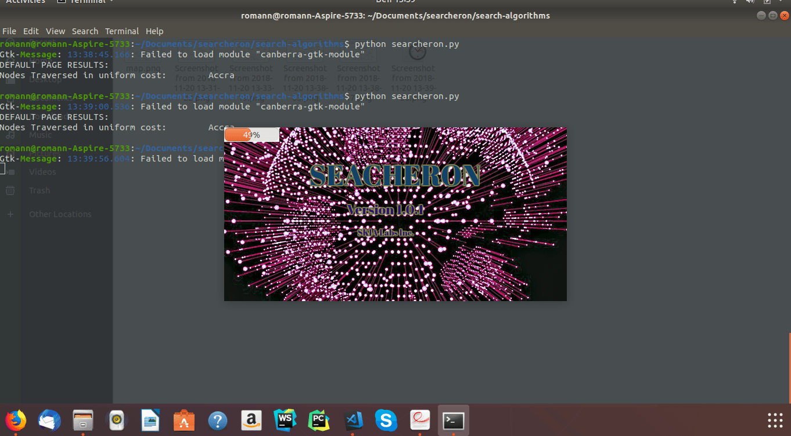
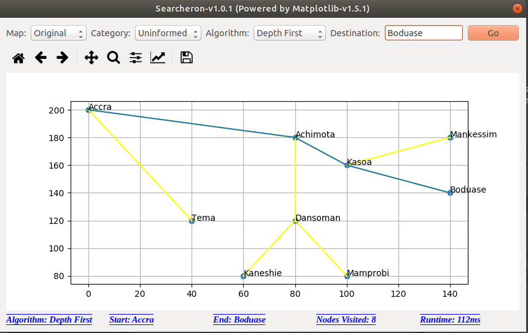
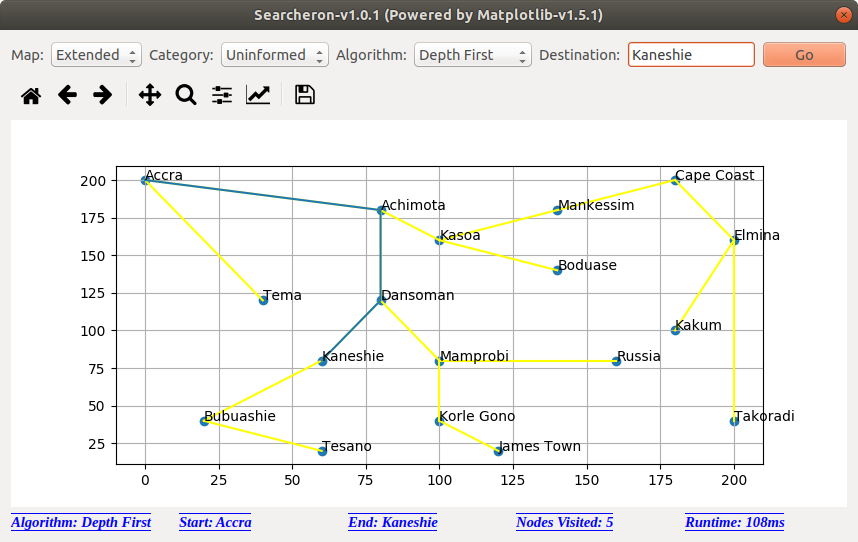
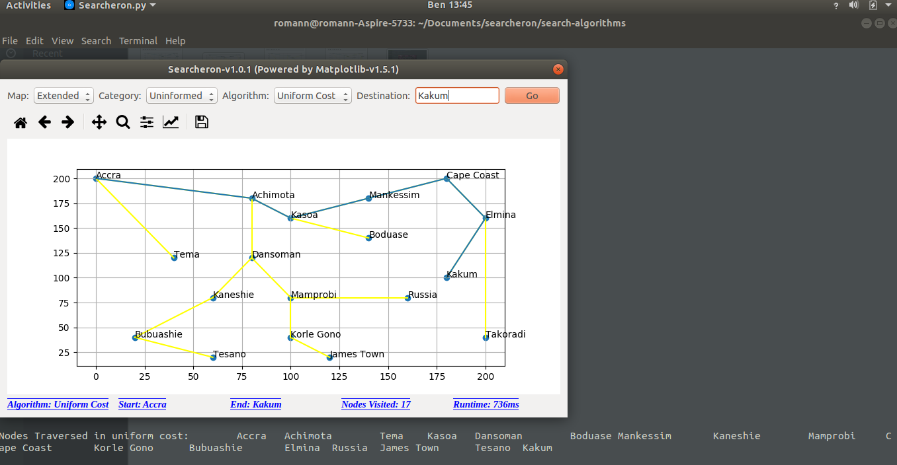
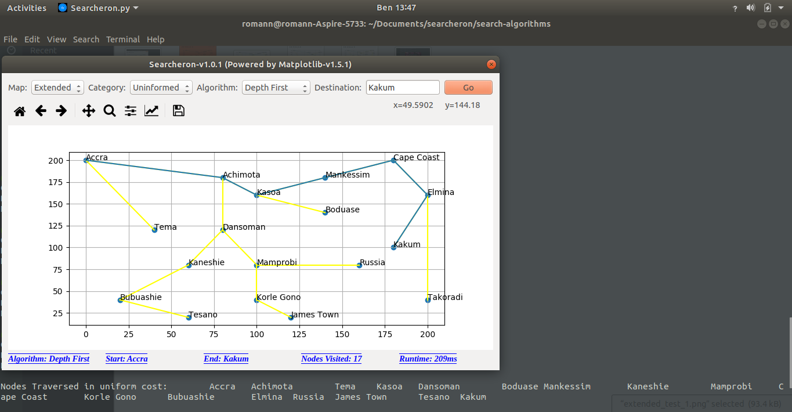

##  Searcheron
**A practical demonstration of graph traversals using sample cities in Ghana as use cases**.
Informed Searching Algorithms implemented include:
* Depth First Search (DFS)
* Breadth First Search (BFS)
* Uniform Cost Search (UCS)

Uninformed Searching Algorithms implemented also include:
* Greedy Best First Search (GBFS)
* A* Searching Algorithm (A*A)

#### Maps to be traversed are in two sections:
1. A less populated (simple) map
2. A much complex map

### Cities in the Simple Map
* Accra
* Tema
* Achimota
* Kasoa
* Dansoman
* Mamprobi
* Kaneshie
* Boduase
* Mankessim

### Cities in the Extended Map
* Accra
* Tema
* Achimota
* Kasoa
* Dansoman
* Mamprobi
* Kaneshie
* Boduase
*  Mankessim
*  Korle Gono
*  James Town
* Russia
* Bubuashie
* Tesano
* Kakum
* Elmina
* Cape Coast
* Takoradi

All these cities are goal states and the algorithms find paths to these goal states

This Program has two run modes: 
* Console mode
* Gui mode

### How  to run the GUI mode
To run the GUI part of the program, run the *searcheron.py* file.
### Simple instructions for running in console mode
To run the console part of the program, run the *console_test.py* file

### Requirements
* Python 2.7 - Code was only tested in Python2.7. I cannot confirm if it run in other Python Versions or not.
* PyQt4 - (How to install PyQt4 in Python2.7 can be found in requirements.txt file)

# Sample Screen Shots of Project
##### Splash Screen during Start Up

##### Traversing the Map from the initial city (Accra) to Boduase using Depth First Search on the Simple Map.

##### Traversing the Map from the initial city (Accra) to Kaneshie using Depth First Search on the Complex Map

##### Traversing the Map from the initial city (Accra) to Kakum using Uniform Cost Search on the Complex Map. (On the console beneath the GUI is a list of cities traversed)

##### Traversing the Map from the initial city (Accra) to Kakum using Depth First Search on the Complex Map. (On the console beneath the GUI is a list of cities traversed)

